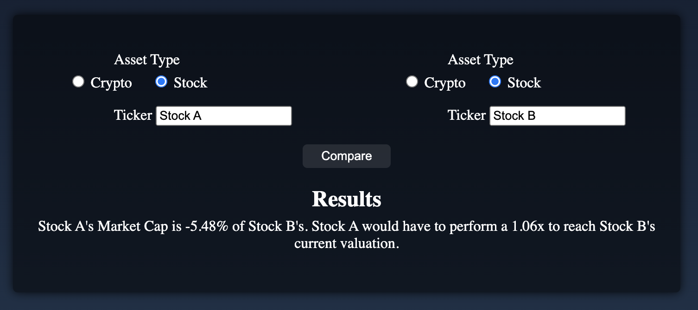
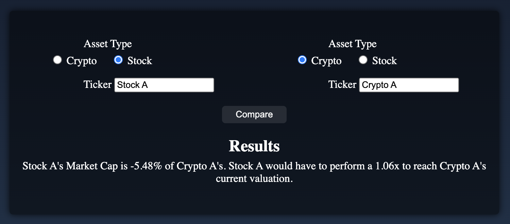
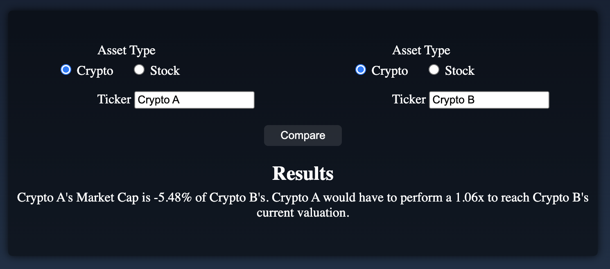

# MarketCap Metrics

## Description

MarketCap Metrics is designed to facilitate the comparison of market capitalization between different asset types including stocks and cryptocurrencies.

## Comparison Types

- **Stock and Stock:**
  - 
- **Stock and Cryptocurrency:**
  - 
- **Cryptocurrency and Cryptocurrency:**
  - 

## APIs

MarketCap Metrics leverages the following APIs:

- **[Alpha Vantage](https://www.alphavantage.co/):** Used for retrieving stock data.
- **[CoinMarketCap](https://coinmarketcap.com/api/):** Used for retrieving cryptocurrency data.

## Sensitive Data Management

- A `config.py` file is utilized to manage sensitive variables, including: `SECRET_KEY_FALLBACK`, `DATABASE_URI_FALLBACK`, `CMC_API_KEY`, and `ALPHA_VANTAGE_API_KEY`.
- To utilize this code, create a `config.py` file and import these variables where needed.
- Example `config.py`:
  ```python
  SECRET_KEY_FALLBACK = "your_secret_key_goes_here"
  DATABASE_URI_FALLBACK = "your_database_uri_goes_here"
  CMC_API_KEY = "your_CMC_API_KEY_goes_here"
  ALPHA_VANTAGE_API_KEY = "your_ALPHA_VANTAGE_API_KEY_goes_here"
  ```
- **Important:** Ensure your `config.py` file is listed in your `.gitignore` file to avoid committing sensitive information.

## Technologies Used

- **Programming Languages:** JavaScript and Python
- **Web Framework:** Flask
- **Database:** PostgreSQL
- **ORM:** SQLAlchemy
- **Authentication:** Flask-Bcrypt for secure password hashing
- **Debugging Tools:**
  - Flask-DebugToolbar for an in-browser debugger.
  - `pdb` for Python's interactive debugging environment.
  - Chrome Developer Tools for frontend debugging and network analysis.
- **Form Handling:** Flask-WTF for form validation and rendering

## Local Development Setup

1. Clone the repository.
2. Navigate to the directory.
3. Create and activate the virtual environment:

   - On macOS and Linux:

     ```bash
     # Create
     python3 -m venv venv

     # Activate
     source venv/bin/activate
     ```

   - On Windows:

     ```bash
     # Create
     python -m venv venv

     # Activate
     .\venv\Scripts\activate
     ```

4. Install Dependencies:

   - ```bash
     pip install -r requirements.txt
     ```

5. Set up your `config.py` as mentioned in the "Sensitive Data Management" section.
   - API keys can be retrieved from: **[Alpha Vantage](https://www.alphavantage.co/)** and **[CoinMarketCap](https://coinmarketcap.com/api/)**
6. Initialize the database.
7. Start the Flask server:

   - ```bash
     flask run
     ```

8. Visit `localhost:5000` in your browser to start using MarketCap Metrics.

---

_This project marks a key milestone in my journey transitioning from a Physical Therapist to a Software Engineer._
